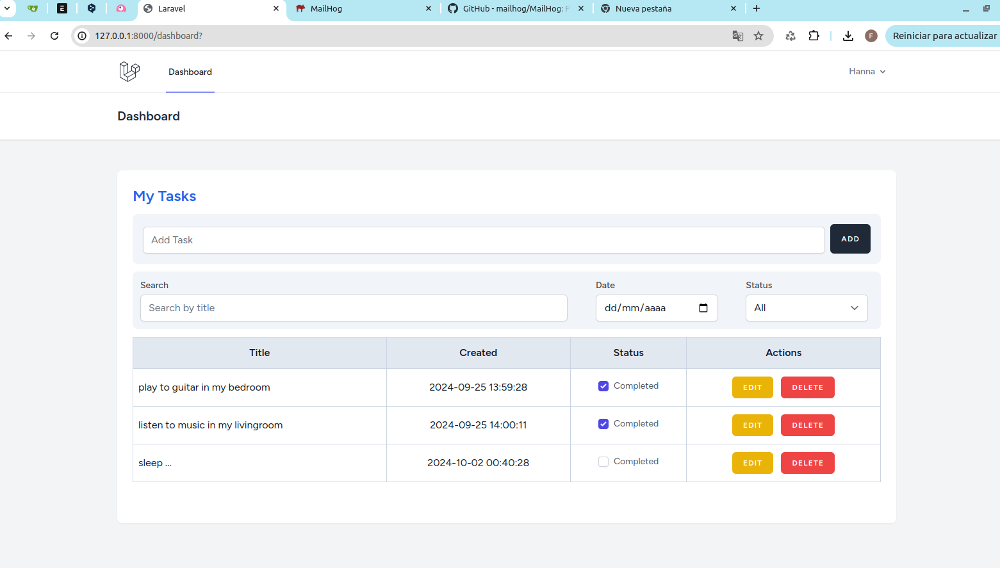
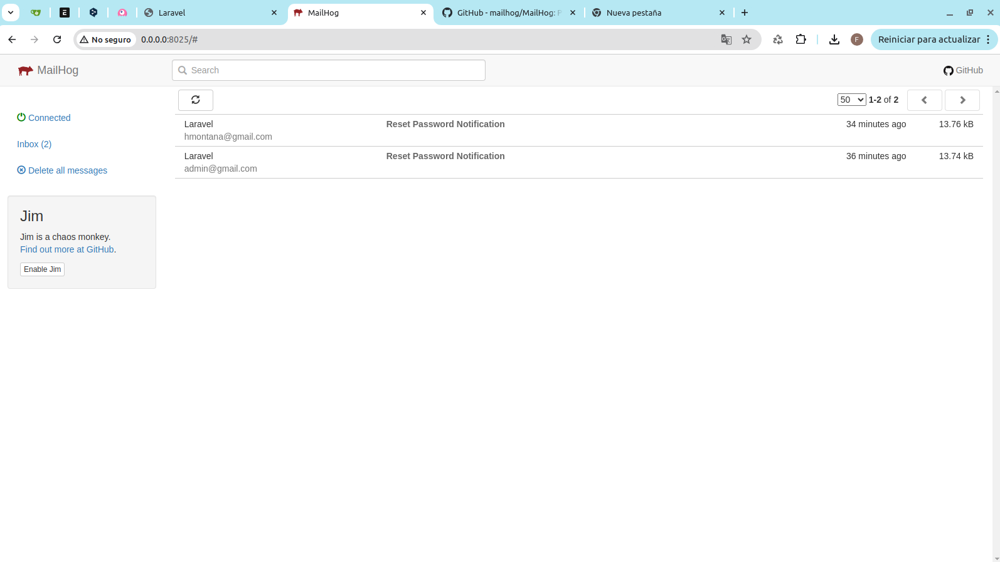

# Aplicación To-Do-List

Este proyecto es una pequeña aplicación realizada con laravel 10 y livewire 3. Con esta aplicación se puede realizar la autenticación de usuarios y la gestión de tareas diarias.

## Funcionalidades
- Registro de usuarios
- Inicio de sesión
- Cierre de sesión
- Recuperación de contraseña
- Crear, editar y eliminar tareas
- Marcar las tareas como completadas
- Filtrar las tareas por título, estado(pendientes, completadas o ambas) y fecha 

## Tecnologías usadas
- Laravel 10
- Livewire 3
- Tailwind
- Laravel Breeze

## Prerequisitos
- PHP
- Composer
- Node.js 
- Npm
- MailHog

## Configurar Proyecto
- composer install
- cp .env.example .env
- php artisan key:generate
- php artisan migrate
- php artisan serve
- http://127.0.0.1:8000/

### Levantar el Backend
- php artisan serve

### Levantar el Frontend
- npm install
- npm run dev

### Simulación de Servidor SMTP (Local) - MailHog
- Instalar en Linux:
    wget https://github.com/mailhog/MailHog/releases/download/v1.0.1/MailHog_linux_amd64
    mv MailHog_linux_amd64 mailhog
    chmod +x mailhog
    sudo mv mailhog /usr/local/bin/
- Instalación en otros Sistemas(Ver la Documentación): https://github.com/mailhog/MailHog/
- Ejecuta en la terminarl: mailhog 
- http://localhost:8025

